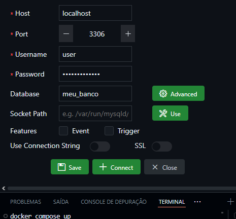

# atividade-de-funcionalidade

### Objetivo:
Criar um back-end com conexão com banco de dados
1. Realizar um CRUD.
- Create (Criar)
- Read (Buscar/Pesquisar)
- Update (Atualizar)
- Delete (Excluir)

2. Utilizar um banco de dados relacional.
- MySQL

### Tecnologias: 
- Linguagem de programação: Python
- ORM: SQLAlchemy
- Banco de dados: MySQL
- Conteinerização: Docker
- Orquestração de contêineres: Docker Compose

- pra conectar o Connect tem que por o (docker compose up)

- pra instalar os requeriments bota(pip install -r requeriments.txt)